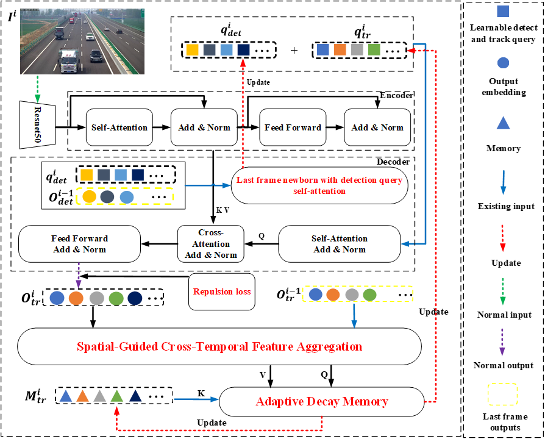

## Abstract
This paper presents Spatial-Temporal Fusion Network with Adaptive Decay Memory for Multi-Vehicle Tracking in Highway Scenarios (STFN-ADM-MTHS), a spatial-temporal fusion network with adaptive decay memory for robust multi-vehicle tracking in highway surveillance scenarios. Addressing challenges posed by camera vibrations, and occlusions, our framework includes four parts. Firstly, a last frame newborn (LFN) module incorporating detection query self-attention to enhance detection-track coordination through temporal context; Secondly, repulsion loss (REP) for improved occlusion handling via bounding box repulsion constraints; Thirdly, spatial-guided cross-temporal feature aggregation (SCFA) using inter-frame interpolation and attention mechanisms to learn vibration-induced motion patterns; Lastly, adaptive decay memory (ADM) that dynamically adjusts memory retention based on motion stability, prioritizing recent observations during stable periods while relying on historical data during occlusions. We contribute the MTHS-SEU dataset containing 21,558 highway surveillance images with diverse environmental challenges. Comprehensive evaluations across MTHS-SEU, UA-DETRAC, and KITTI benchmarks demonstrate superior performance, achieving 72.197% HOTA on our dataset. Ablation studies confirm individual module effectiveness, with SCFA and ADM particularly effective for vibration compensation and occlusion handling respectively. Given the high-dimensional spatiotemporal features and the need for long-sequence trajectory modeling under vibration and occlusion, our framework leverages GPU-accelerated parallel processing to sustain real-time inference. This capability is critical for meeting the safety-critical response needs of intelligent transportation systems. The framework maintains real-time capability at 10.5 FPS, showing significant improvements over state-of-the-art trackers in association metrics while balancing detection accuracy through joint query decoding optimization. The results show that the STFN-ADM-MTHS model effectively addresses the inter-frame trajectory displacement caused by camera vibrations.


## Method
|  | 
|:--:| 
| ***Fig 2. Overview of STFN-ADM-MTHS framework. (The tracking process follows a detection and tracking query joint decoding paradigm, the red font shows improvements. The initial input is the image at frame i, tracking results O_tr^i is the final results. First, the image at frame i is processed through ResNet-50 and the Encoder structure to learn 2D features, where the encoder procedure is implemented according to the reference [5] and different colors represent different vehicles. During decoding, q_det^i and q_tr^i vectors are uniformly initialized and will further optimized, initialized according to reference [7], the Last frame newborn with detection query self-attention incorporates the output O_det^(i-1) from frame i−1 to update q_det^i for frame i, combining Repulsion loss produces O_tr^i, the specific details are provided in section A and B. Finally, combining the i-1 frame’s outputs O_tr^(i-1), Spatial-guided cross-temporal feature aggregation captures motion vibration, the specific details are provided in section C. Utilizing the memory of frame i and the vibration learning from the previous step, M_tr^i vectors is initialized and will further optimized, the adaptive decay memory structure updates the frame i+1’s memory and query M_tr^(i+1) and q_tr^(i+1), the specific details are provided in section D.)* |


## Installation

**a. Create a conda virtual environment and activate it.**
```shell
conda create -n STFN python=3.8 -y
conda activate STFN
```

**b. Install PyTorch and torchvision**
```shell
conda install pytorch==1.13.1 torchvision==0.14.1 torchaudio==0.13.1 pytorch-cuda=11.7 -c pytorch -c nvidia
# Recommended torch>=1.9
```

**c. Install Other dependencies.**
```shell
conda install matplotlib pyyaml scipy tqdm tensorboard
pip install opencv-python
```

**d. Compile the Deformable Attention CUDA ops.**
```shell
cd ./models/ops/
sh make.sh
```

## Data

Dataset structure:
```
DATADIR/
  ├── MTHS-SEU/
  │ ├── train/
  │ ├── val/
  │ ├── train_seqmap.txt
  │ ├── val_seqmap.txt
  ├── UA-DETRAC/
  │ ├── train/
  │ ├── val/
  │ ├── test/
  │ ├── train_seqmap.txt
  │ ├── val_seqmap.txt
  │ └── test_seqmap.txt
  ├── KITTI/
  │ ├── train/
  │ ├── val/
  │ ├── test/
  │ ├── train_seqmap.txt
  │ ├── val_seqmap.txt
  │ └── test_seqmap.txt

```

### Training
Train MeMOTR on MTHS-SEU
```shell
python main.py --config-path ./configs/train_mths_seu.yaml --outputs-dir ./outputs/train_mths_seu/ --batch-size 1 --data-root <your data dir path>
```

### Evaluation
You can use this script to evaluate the trained model on the MTHS-SEU val set:
```shell
python main.py --mode eval --data-root <your data dir path> --eval-mode specific --eval-model <filename of the checkpoint> --eval-dir ./outputs/mths_seu/ --eval-threads <your gpus num>
```

## Acknowledgement
- [MeMOTR](https://github.com/MCG-NJU/MeMOTR.git).
- [Deformable DETR](https://github.com/fundamentalvision/Deformable-DETR)
- [DAB DETR](https://github.com/IDEA-Research/DAB-DETR)
- [MOTR](https://github.com/megvii-research/MOTR)
- [TrackEval](https://github.com/JonathonLuiten/TrackEval)
